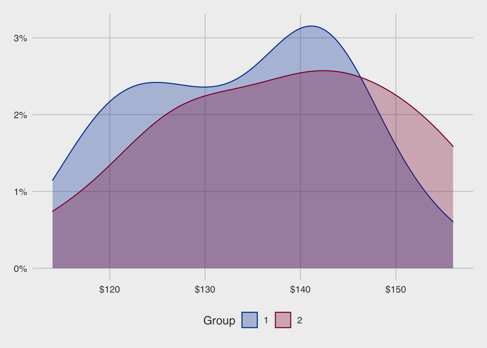

[Home page](https://seimwiwa.github.io/scu_master_degree_program_data_science_statistical_analysis/)

# Key point


# Proportion

假設有一群樣本 n 來自 binominal distrebution

則發生事件 x 的比例（百分比），可以記錄為：

$ p = \frac{x}{n} = \frac{number of success}{sample size}$

$ z_{cal} = \frac{p - \pi_0}{\sigma_p} = $

# 檢定統計量

## Z 檢定 Known variance

## 兩個獨立樣本 T 檢定 Two sample T test Unknown variancebut assume equal

變異數同質

### On-class practice

#### 樣本分佈



<table class="table table-hover table-striped" style="width: auto !important; margin-left: auto; margin-right: auto;">
 <thead>
  <tr>
   <th style="text-align:right;"> 組別 </th>
   <th style="text-align:right;"> 樣本數 </th>
   <th style="text-align:right;"> 平均值 </th>
   <th style="text-align:right;"> 標準差 </th>
   <th style="text-align:right;"> 25% </th>
   <th style="text-align:right;"> 50% </th>
   <th style="text-align:right;"> 75% </th>
  </tr>
 </thead>
<tbody>
  <tr>
   <td style="text-align:right;"> 1 </td>
   <td style="text-align:right;"> 16 </td>
   <td style="text-align:right;"> 133.99 </td>
   <td style="text-align:right;"> 11.01 </td>
   <td style="text-align:right;"> 124.28 </td>
   <td style="text-align:right;"> 135.48 </td>
   <td style="text-align:right;"> 142.42 </td>
  </tr>
  <tr>
   <td style="text-align:right;"> 2 </td>
   <td style="text-align:right;"> 13 </td>
   <td style="text-align:right;"> 138.02 </td>
   <td style="text-align:right;"> 12.66 </td>
   <td style="text-align:right;"> 126.41 </td>
   <td style="text-align:right;"> 139.19 </td>
   <td style="text-align:right;"> 145.32 </td>
  </tr>
</tbody>
</table>

#### 獨立樣本 t 檢定，雙尾，變異數不相等


```
## 
## 	Welch Two Sample t-test
## 
## data:  dat_price_1 and dat_price_2
## t = -0.9018, df = 24.025, p-value = 0.3761
## alternative hypothesis: true difference in means is not equal to 0
## 95 percent confidence interval:
##  -13.235294   5.185871
## sample estimates:
## mean of x mean of y 
##  133.9938  138.0185
```

#### 獨立樣本 t 檢定，雙尾，變異數相等


```
## 
## 	Two Sample t-test
## 
## data:  dat_price_1 and dat_price_2
## t = -0.91531, df = 27, p-value = 0.3681
## alternative hypothesis: true difference in means is not equal to 0
## 95 percent confidence interval:
##  -13.046776   4.997353
## sample estimates:
## mean of x mean of y 
##  133.9938  138.0185
```

#### F 檢定測試變異數是否相等


```
## 
## 	F test to compare two variances
## 
## data:  dat_price_1 and dat_price_2
## F = 0.75663, num df = 15, denom df = 12, p-value = 0.6016
## alternative hypothesis: true ratio of variances is not equal to 1
## 95 percent confidence interval:
##  0.2381445 2.2421171
## sample estimates:
## ratio of variances 
##          0.7566329
```


## Unknown variancebut assume not equal

